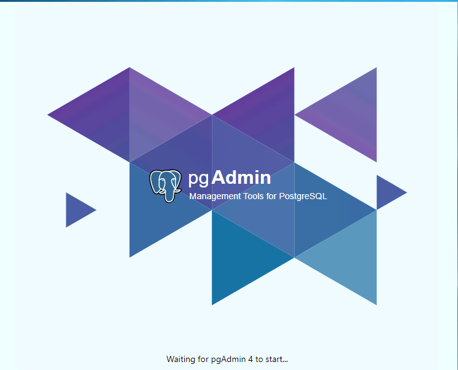
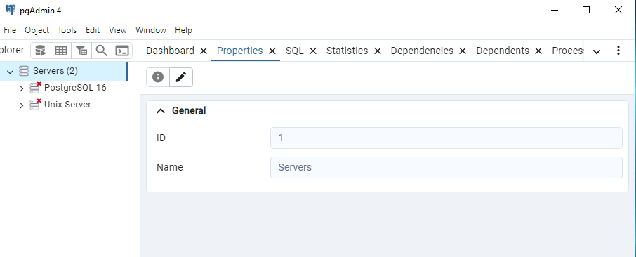
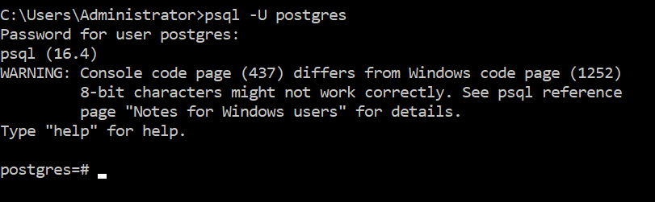
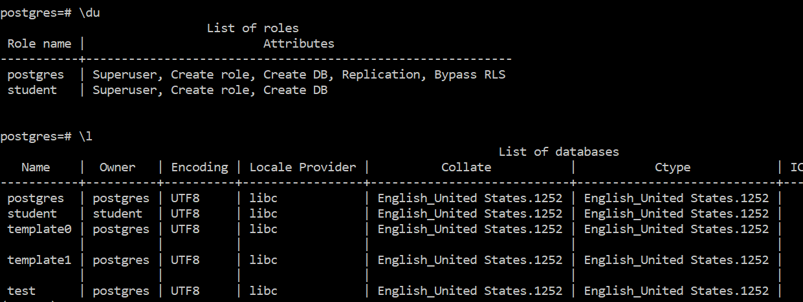
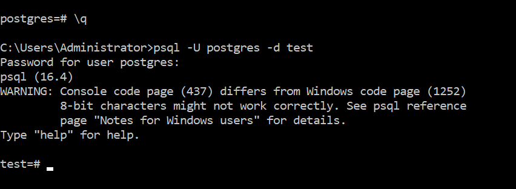
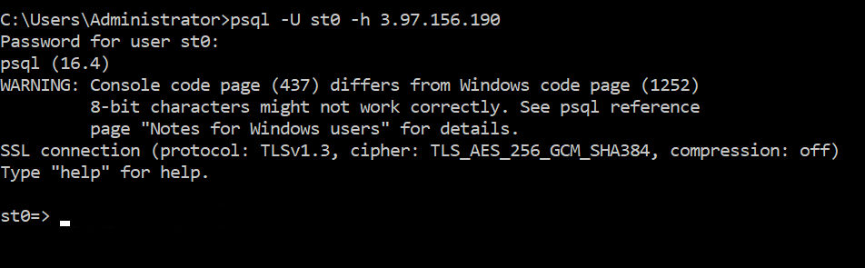
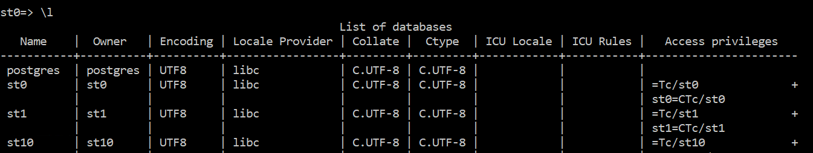
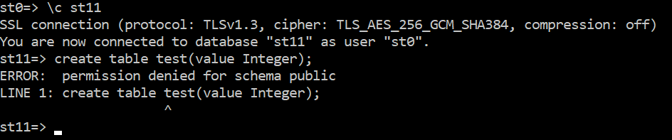

# Lab 1: Getting Started

#### Objectives

1. Login to your assigned VM
2. Get started with PgAdmin
3. Connect to your local Windows PostgreSQL instance
4. Connect to a remote Unix PostgreSQL instance


## Part 1: Login to your VM

The instructor will walk you through the process of logging into your VMs. There is additional documentation on this how to use the Protech virtual machines in the VMs directory in the repository.

## Part 2: Start PgAdmin

The `PgAdmin` utility is an add-on to PostgreSQL that provides a GUI for administering PostgreSQL servers. 

You will **_not_** be using `PgAdmin` to make changes to either running Unix PostgreSQL instance or your Windows instance, that will be done at the command line.

However, you will use the GUI to help you visualize what is happening in your instance.

Start the GUI by clicking on the elephant icon on the taskbar. You should see the start-up screen show below



After a few moments, the following should appear. You may have to expand the `Servers` item. Once you do that, you should see the two servers listed.

The red x means that `PgAdmin` has not yet connected to the servers.



Click on both of the icons with the red x to connect to the servers. Then you should be able to expand the display to show the databases, table spaces and users on each server instance. Note that the Windows server also has an additional extension called `pgAgent`

---

## Part 3: Logging in locally

For this section, open a command prompt in your Protech VM

First, login as `postgres` using `psql -U postgres` 

The password for all accounts is `Pa$$w0rd`



Note that be default the `postgres` user logs into the `postgres` database. This is the system database that contains information about this database cluster.

The `#` prompt indicates that this is a superuser.

List the users using the `\du` command and then list the databases using the `\l` command.



Logout using the \q command and log back in, but start the session in the `test` database.



Logout using `\q`

If you want to experiment, try something similar with the `student` account.

---

## Part 4: Logging in to a remote server

For this section, you will be using an id that is assigned to you to log into a remote server. Your id is in the VM.png file in the VMs directory in the repository.

The host you will be logging into is an AWS EC2 Ubuntu instance running PostgreQL 16.

To log in, find your `id` in the list. The instructor will be using the id `st0`. The password for all the student is `Pa$$w0rd` and the process will be the same for each id.

Note that you cannot log into the server, but you can open a PostgreSQL client on the server. You have to specify your username and the host id like this:

```shell
psql -U st0 -h 3,97.156.190
```

You should see something like this:



Notice the prompt that indicates `st0` is a regular user. Also note that you are currently logged into a database with the same name as your login id.

Now list the databases using the `\l` command and you should see something like this.



Note that you can connect another user's database, but you can't alter it.



---

## Cleanup

Make sure you log out of your remote connection using the `\q` command to quite the psql client.

---

## End Lab